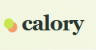
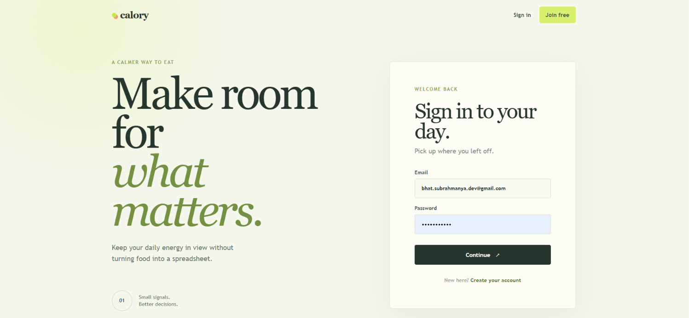
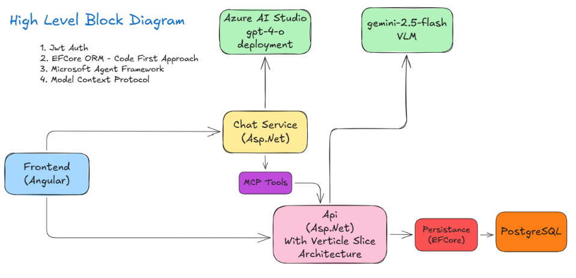

<h1 align="center">
  
  Calory
</h1>

Calory is a full-stack nutrition tracking application. It helps users record meals, manage time-bound health goals, understand calorie and nutrient consumption, and interact with their nutrition data through an AI assistant.

> [Demo](https://drive.google.com/file/d/1fL9RBAUq5pBbI8BQ7T-sv5xc5N9EGtwu/view?usp=sharing)


## What It Does

- Create, edit, delete, and search food entries.
- Organize entries by breakfast, lunch, dinner, and snack.
- Track calories, macronutrients, fiber, sugar, minerals, and vitamins.
- Create goal periods with calorie, macro, and weight targets.
- Prevent overlapping goal date ranges.
- Show the goal that applies to the current date on the home dashboard.
- View goal history and edit previous or upcoming goals.
- Filter food history by date range, meal type, and calorie range.
- View paginated food entries, goals, reports, and trend data.
- Display calorie, macro, micronutrient, and vitamin trends.
- Analyze food images with AI and pre-fill nutrition data.
- Import tabular food diaries from PDF files.
- Ask the Calory AI assistant questions about meals, goals, and trends.
- Access application operations through authenticated MCP tools.

## Architecture




The application uses:

- Angular 21 for the frontend.
- ASP.NET Core and FastEndpoints for the API.
- Entity Framework Core 10 with PostgreSQL.
- JWT bearer authentication shared by the API and Chat Service.
- Azure OpenAI for the chat assistant.
- Google Gemini for food image analysis.
- Model Context Protocol for authenticated nutrition tools.
- PdfPig for tabular PDF food-diary import.

## Local Setup

### Prerequisites

- .NET 10 SDK
- Node.js and npm
- Docker Desktop or WSL
- PostgreSQL, supplied through Docker Compose
- Azure OpenAI credentials for chat
- Gemini API credentials for image analysis

### Start PostgreSQL

From the repository root:

```powershell
docker compose -f .\backend\Setup\compose.yml up -d
```

PostgreSQL is available on port `5432`. Adminer is available at `http://localhost:8080`.

The API applies EF Core migrations automatically when it starts. The migrations are stored in:

```text
backend/Calory/Calory.Persistance/Migrations
```

### Start the API

Configure keys in the `appsettings.json` before running the api
```json
 "Jwt": {
   "Issuer": "Calory.Api",
   "Audience": "Calory.Client",
   "Key": "development-only-change-this-jwt-key-to-a-long-random-secret",
   "ExpirationMinutes": 60
 },
 "Gemini": {
   "Model": "gemini-2.5-flash",
   "ApiKey": "<YOUR_GEMINI_API_KEY>"
 },
```
```powershell
dotnet run --project .\backend\Calory\Calory.Api\Calory.Api.csproj
```

The API reads its PostgreSQL and JWT settings from `appsettings.json` and environment-specific configuration. Swagger is enabled in Development.

### Start the Chat Service

Configure Azure OpenAI and the MCP endpoint in the Chat Service configuration, 
```json
 "Mcp": {
   "Endpoint": "http://localhost:5290/mcp"
 },
 "Jwt": {
   "Issuer": "Calory.Api",
   "Audience": "Calory.Client",
   "Key": "development-only-change-this-jwt-key-to-a-long-random-secret",
   "ExpirationMinutes": 60
 }
```
use same configuration used in `api` for jwt config
then run:

```powershell
dotnet run --project .\backend\Calory\Calory.ChatService\Calory.Ai.Orchestrator.csproj
```

The orchestrator accepts authenticated chat requests at:

```text
POST /api/chat/stream
```

It forwards the caller's validated JWT to the API MCP endpoint so MCP tools operate on that user's data.

### Start the frontend

```powershell
Push-Location .\frontend
npm install
npm start
Pop-Location
```

> If you encounter any problem while `npm i` use command `npm config set legacy-peer-deps true`

The Angular development server runs at `http://localhost:4200/` by default.

## Authentication

Users register and log in through the API. Login returns a JWT:

```text
POST /api/auth/login
```

Authenticated requests use:

```http
Authorization: Bearer <jwt>
```

The API and Chat Service use the same JWT issuer, audience, signing key, expiration, and clock-skew settings. Keep the signing key in environment-specific configuration or user secrets outside production source control.

### MCP

The authenticated MCP server is available at:

```text
/mcp 
```

MCP tools cover food entries, goals, reports, user profile operations, nutrition summaries, and food image analysis. The MCP endpoint requires a valid JWT and uses the authenticated user's identity for every operation.

## Frontend Routes

- `/home` - daily dashboard, actions, goals, recent food, and nutrition charts.
- `/query` - searchable and paginated food journal.
- `/goals/history` - goal date ranges and historical targets.
- `/login` - sign in.
- `/register` - create an account.

## Development Commands

Build the API:

```powershell
dotnet build .\backend\Calory\Calory.Api\Calory.Api.csproj
```

Build the Chat Service:

```powershell
dotnet build .\backend\Calory\Calory.Ai.Orchestrator\Calory.Ai.Orchestrator.csproj
```


## Data and Security Notes

- All food, goal, report, and MCP operations are scoped to the authenticated user.
- PDF imports accept files up to 10 MB and report skipped rows instead of silently importing invalid data.
- Do not commit Azure OpenAI, Gemini, database, or production JWT secrets.
- Use HTTPS and a strong environment-specific JWT signing key outside local development.
